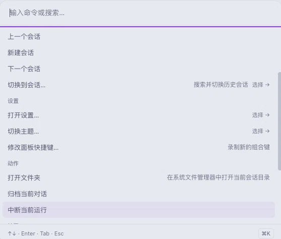

# DSH Command Palette

为 DeepSeek Harness Web GUI 提供键盘优先的快捷操作面板。无需让手离开键盘，通过一个快捷键即可搜索并执行常用功能。



## 功能

### 快捷操作面板

- macOS 按 `⌘K` 打开
- Windows / Linux 按 `Ctrl+K` 打开
- 面板和每条常用命令都有默认快捷键，并可分别修改或清除
- 输入关键词快速筛选功能
- 使用 `↑` / `↓` 选择，`Enter` 执行，`Esc` 关闭或返回
- 简单命令通过快捷键直接执行；设置、主题等带选项的命令会直接打开对应选择列表

### 默认快捷键

| 功能 | macOS | Windows / Linux |
|---|---|---|
| 打开命令面板 | `⌘K` | `Ctrl+K` |
| 新建对话 | `⌘⌥N` | `Ctrl+Alt+N` |
| 上一个 / 下一个对话 | `⌘⌥↑` / `⌘⌥↓` | `Ctrl+Alt+↑` / `Ctrl+Alt+↓` |
| 切换对话 | `⌘⌥G` | `Ctrl+Alt+G` |
| 打开文件夹 | `⌘⌥O` | `Ctrl+Alt+O` |
| 归档对话 | `⌘⌥A` | `Ctrl+Alt+A` |
| 中断运行 | `⌘⌥X` | `Ctrl+Alt+X` |
| 打开设置 | `⌘⌥,` | `Ctrl+Alt+,` |
| 切换主题 | `⌘⌥T` | `Ctrl+Alt+T` |
| 展开 / 收起右侧边栏 | `⌘J` | `Ctrl+J` |
| 打开终端 | `⌘⇧J` | `Ctrl+Shift+J` |
| 打开任务看板 | `⌘⌥B` | `Ctrl+Alt+B` |
| 打开技能中心 | `⌘⌥S` | `Ctrl+Alt+S` |
| 打开 / 隐藏宠物 | `⌘⌥P` / `⌘⌥⇧P` | `Ctrl+Alt+P` / `Ctrl+Alt+Shift+P` |

可选插件未安装或对应功能被禁用时，其快捷键不会执行操作。

### 修改快捷键

1. 打开命令面板并选择“自定义命令快捷键…”；
2. 选择要修改的命令；
3. 按下新的组合键完成录制。

录制时按 `Delete` 或 `Backspace` 可以清除该命令的快捷键，按 `Esc` 取消。插件会检测内部快捷键冲突，并在每条命令右侧显示当前快捷键。

### 对话管理

- 最近对话显示在列表顶部
- 会话行显示所属项目名称，输入项目名即可筛选出该项目的会话
- 新建对话
- 切换到上一个或下一个对话
- 搜索并切换历史对话
- 归档当前对话
- 在系统文件管理器中打开当前对话的文件夹
- 中断当前运行

### 快速设置

- 打开设置
- 直接进入通用、模型、插件、代理预设等设置页面
- 切换浅色、深色或跟随系统主题
- 在面板内修改快捷键

### 可选插件集成

检测到对应功能时，面板会自动增加相关入口：

- **DSH 官方右侧边栏**：展开或收起侧边栏
- **dsh-better-sidebar**：打开终端；新版会在 DSH 官方右侧边栏中显示，旧版仍可使用原面板
- **dsh-pet**：打开宠物、隐藏宠物
- **dsh-task-board**：打开或关闭任务看板
- **dsh-skill-explorer**：打开技能中心

这些插件无论单独安装，还是随插件合集安装，都可以被识别。设置直达会按页面名称查找，因此第三方插件新增设置页面后也不会改变“通用设置、模型、插件、Agent 预设”的目标。

## 安装

包名是 `dsh-palette`（GitHub 仓库名沿用 `dsh-command-palette`）。

```bash
dsh plugin --profile web add dsh-palette@latest
```

安装完成后重启 `dsh web`，刷新页面，按 `⌘K`（Windows / Linux 为 `Ctrl+K`）即可使用。

该命令会自动把它登记为 profile 插件层（包内声明了 `cordis.patch.yml`），不需要手工改配置。

## 更新

```bash
dsh plugin --profile web add dsh-palette@latest
```

客户端功能更新后刷新页面即可；若更新涉及宿主功能（`/open-folder` 命令），请重启 `dsh web`。

## 卸载

```bash
dsh plugin --profile web remove dsh-palette
```

卸载后重启 `dsh web`。

## 开发

```bash
pnpm install
pnpm run test
pnpm run typecheck
pnpm run build
pnpm run dev
```

改代码时用软链方式安装，构建后刷新页面即可生效（`pnpm run dev` 会监听源码自动重建）：

```bash
dsh plugin --profile web add "$PWD"
```

软链安装与上面的 npm 安装是同一个包名，二者互斥；切换前先 `dsh plugin --profile web remove dsh-palette`。

发布新版本：改 `package.json` 的 `version`（npm 不接受重复版本号）后执行 `npm publish`（`prepack` 会自动构建）。

## 许可证

MIT
